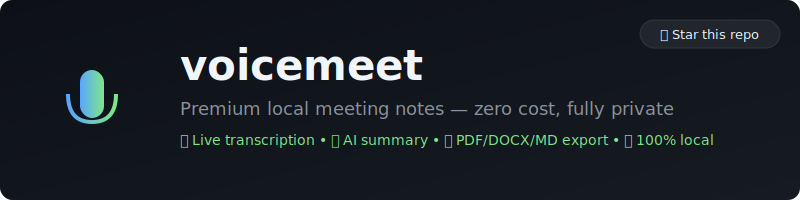

<div align="center">
 

 
### Premium local meeting notes — zero cost, fully private, no cloud.
 
[](https://github.com/matteo-ise/voicemeet/actions)
[](https://opensource.org/licenses/MIT)
[](https://www.python.org/downloads/)
[](https://www.apple.com/macos)
[](CONTRIBUTING.md)
 
**A local, open-source meeting assistant inspired by premium tools like Granola.**
 
Live transcription · Speaker diarization · AI summary · PDF/DOCX/MD export · Session memory · Auto-detection · Menubar daemon · Global hotkey
 
</div>
 
---
 
## Why voicemeet?
 
We love tools like **Granola** — they have set a beautiful standard for how meeting notes, transcripts, and AI summaries should work. However, many of us handle highly confidential discussions where sending audio or transcripts to the cloud is not an option.
 
We built **voicemeet** to provide a similar premium experience, but built entirely on top of local, open-source AI:
 
- **100% Private**: Everything (audio capture, speech-to-text, and summaries) runs strictly on your machine. No data ever leaves your device.
- **Zero Cost**: No subscriptions, API keys, or cloud platform fees needed.
- **Developer Friendly**: Open-source, extensible, and fully customizable.
 
| Feature | voicemeet | Granola |
|---|:---:|:---:|
| **Live Transcription** | ✅ Local | ✅ Cloud |
| **Speaker Diarization** | ✅ Local | ✅ Cloud |
| **AI Summary** | ✅ Local | ✅ Cloud |
| **Export (PDF/DOCX/MD)** | ✅ Free | 💰 Pro |
| **Session Memory** | ✅ Free | 💰 Pro |
| **Data Privacy** | **100% Offline** | Cloud |
 
---
 
## Demo
 

 
*Full walkthrough: `setup` → `record --dry-run` → `list` → `show` → `export` → `search`*
 
---
 
## Features
 
### 🎙️ Live transcription
Real-time Whisper `large-v3-turbo` via whisper.cpp, optimized for Apple Silicon with Metal acceleration. Streaming VAD detects speech segments and transcribes them as you talk — no waiting until the end.
 
### 🧑‍💼 Speaker diarization
Spectral feature extraction + KMeans clustering assigns "Speaker 1/2/3" labels automatically. No pyannote API key, no HuggingFace token — pure scipy + scikit-learn, runs locally.
 
### 🧠 AI summary with structured header
Ollama generates a meeting summary with:
- **Header**: Date, time, duration, participants, topics
- **Summary**: 2-4 paragraph Markdown overview
- **Action items**: Checklist with assignees
 
### 📄 One-click export
| Format | Library | Contents |
|--------|---------|---------|
| **PDF** | reportlab | Title, metadata table, summary, action items, transcript table |
| **DOCX** | python-docx | Headings, metadata, summary, action item bullets, transcript table |
| **Markdown** | stdlib | Full document with speaker-attributed transcript |
 
### 💾 Session memory
Every meeting is stored in a local SQLite database. Search across all transcripts, reload any session, re-export in any format.
 
### 🔔 Auto meeting detection
Background daemon watches for meeting apps (Zoom, Teams, Meet, Discord, Notion, Webex) and confirms with audio VAD. Sends a macOS notification: *"Meeting detected — start recording?"*
 
### 📊 Menubar daemon + global hotkey
- **VM** icon in your menubar — click for controls
- **⌘⇧M** toggles recording from any app
- Auto-starts on login (via LaunchAgent)
 
---
 
## Installation
 
### Prerequisites
- macOS Apple Silicon (M1+)
- Python 3.11+
- [Ollama](https://ollama.ai) (for AI summaries)
 
### Quick Start (60 seconds)
 
Clone the repository and run the installer:
 
```bash
git clone https://github.com/matteo-ise/voicemeet.git
cd voicemeet
./scripts/install.sh
```
 
The installer:
1. ✅ Installs voicemeet and its dependencies
2. ✅ Pulls `llama3.2` for Ollama summaries
3. ✅ Detects your existing Whisper models (OpenSuperWhisper compatible)
4. ✅ Sets up a LaunchAgent to start the menubar daemon on login
 
---
 
### Optional: Capture System Audio (Online Meetings)
 
To capture system audio (Zoom, Meet, Teams) in addition to your mic:
 
```bash
brew install blackhole-2ch
./scripts/setup_blackhole.sh
```
 
Then use `--mode online`:
```bash
voicemeet record --title "Client Call" --mode online
```
 
---
 
## How to Use
 
You can control voicemeet via your Menubar, Global Hotkeys, or CLI.
 
### 1. Menubar & Global Hotkey (Recommended)
- Click the **VM** icon in your menubar to start, stop, or configure recording.
- Press **⌘⇧M** anywhere to toggle recording instantly.
- Once stopped, a structured summary will be generated and saved.
 
### 2. CLI Guide
 
```bash
# Health check — verify all components are ready
voicemeet setup

# Record standard room meeting (mic + diarization)
voicemeet record --title "Team Standup" --mode room

# Dry run — test full pipeline without microphone
voicemeet record --dry-run --title "Test"

# List all sessions
voicemeet list

# Show session details + full transcript
voicemeet show <session-id>

# Export to all formats (PDF, DOCX, Markdown)
voicemeet export <session-id> --format all

# Search across all transcripts
voicemeet search "quarterly budget"
```
 
---
 
## Configuration
 
| Setting | Env var | Default |
|---------|---------|---------|
| Database | `VOICEMEET_DB` | `~/.voicemeet/voicemeet.db` |
| Model path | `VOICEMEET_MODEL_PATH` | Auto-detect (OpenSuperWhisper, `~/.voicemeet/models/`) |
| Exports | — | `~/.voicemeet/exports/` |
| Recordings | — | `~/.voicemeet/recordings/` |
 
---
 
## How it works
 
```
                    voicemeet pipeline
 
  ┌──────────┐     ┌──────┐     ┌──────────┐     ┌──────────┐
  │  Audio   │────▶│ VAD  │────▶│ Whisper  │────▶│ Segments │
  │  Capture │     │      │     │ (.cpp)   │     │ in SQLite│
  └──────────┘     └──────┘     └──────────┘     └──────────┘
       │                                              │
       │                                    ┌─────────┘
       ▼                                    ▼
  ┌──────────┐                     ┌──────────────┐
  │  Diarize │────────────────────▶│ Ollama       │
  │ (sklearn)│                     │ Summary      │
  └──────────┘                     └──────────────┘
                                          │
                                   ┌──────┘
                                   ▼
                          ┌──────────────────┐
                          │ Export: PDF/DOCX/MD│
                          │ + Session in DB   │
                          └──────────────────┘
```
 
### Tech stack
 
| Layer | Technology | Why |
|-------|-----------|-----|
| Transcription | whisper.cpp (pywhispercpp) | Reads ggml .bin models, Metal backend, reuses OpenSuperWhisper models |
| Audio | sounddevice + numpy | Standard, reliable, BlackHole-compatible |
| Summary | Ollama (llama3.2) | Local, no API key, Apple Silicon optimized |
| Storage | sqlite3 (stdlib) | Zero dependency, robust, full-text search |
| PDF | reportlab | Mature, professional output |
| DOCX | python-docx | Standard for Word documents |
| CLI | typer + rich | Beautiful terminal UI |
| Menubar | rumps | Simplest macOS menubar lib |
| Hotkey | pynput | Global keyboard shortcuts |
| Diarization | scipy + scikit-learn | No API key, no model download |
 
---
 
## Privacy
 
**Everything runs locally. No cloud, no API keys, no telemetry.**
 
- Audio is captured and processed on-device.
- Transcription runs via local Whisper model.
- Summaries are generated by Ollama on `localhost:11434`.
- Sessions are stored in a local SQLite database.
- No analytics, no tracking, no data ever leaves your machine.
 
---
 
## Roadmap
 
See [ROADMAP.md](./ROADMAP.md) for the full plan.
 
- **v1.1** — Named speaker identification, pyannote diarization
- **v1.2** — Calendar integration, pre-meeting briefs
- **v1.3** — Windows/Linux support
- **v1.4** — py2app bundle, notarized release
- **v2.0** — Chat with your meetings (RAG over session DB)
 
---
 
## Contributing
 
Contributions are welcome! See [CONTRIBUTING.md](./CONTRIBUTING.md).
 
Pull requests are merged faster if they:
- Pass `pytest tests/ -q` and `ruff check src/`
- Use conventional commits (`feat:`, `fix:`, `docs:`)
- Don't add cloud dependencies or API keys
 
---
 
## Uninstall
 
```bash
./scripts/uninstall.sh           # Stop daemon, remove LaunchAgent
./scripts/uninstall.sh --purge   # Also delete session data
```
 
---
 
## License
 
MIT — see [LICENSE](./LICENSE).
 
---
 
<div align="center">
 
**⭐ If voicemeet saves you money on meeting notes, star this repo.**
 
Made with ❤️ for people who value privacy.
 
</div>
